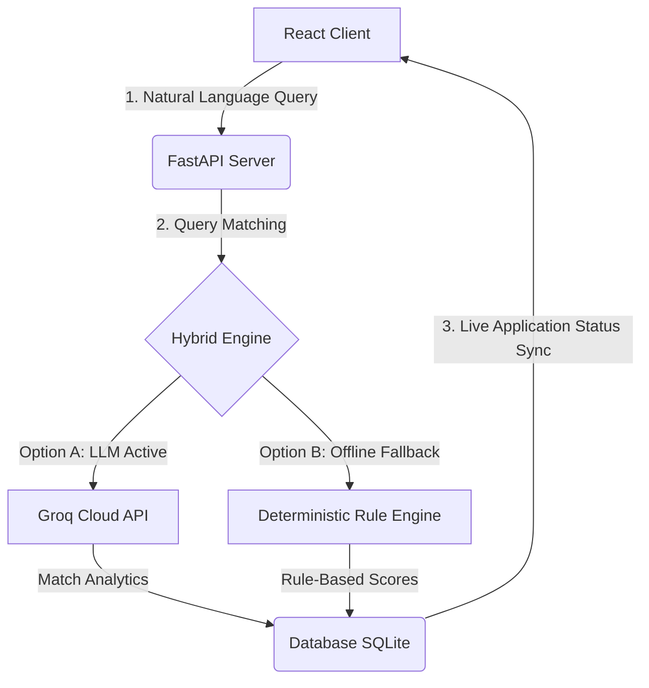

# 💼 AI Job Board with Candidate Matching

[](https://fastapi.tiangolo.com/)
[](https://react.dev/)
[](https://www.sqlite.org/)
[](https://groq.com/)
[](https://render.com/)

A premium, full-stack job board application featuring real-time job application tracking and **AI-powered candidate-to-job matching** using LLMs. Built using a robust FastAPI Python backend and a highly responsive React/Vite frontend.

---

## 📌 Table of Contents

1. [Key Features](#-key-features)
2. [Tech Stack](#%EF%B8%8F-tech-stack)
3. [System Architecture](#-system-architecture)
4. [Folder Structure](#-folder-structure)
5. [Getting Started & Setup](#-getting-started--setup)
6. [Demo Accounts & Credentials](#-demo-accounts--credentials)
7. [Render Deployment Guide](#-render-deployment-guide)
8. [CORS Configuration](#-cors-configuration)
9. [Future Enhancements](#-future-enhancements)
10. [License](#-license)

---

## 🌟 Key Features

### 🏢 Company Admin Dashboard
- **Create & Manage Listings:** Create, edit, and control status (Open/Closed) of job posts.
- **Application Pipeline:** Track candidates applying for jobs in real time.
- **Dynamic Action Workflows:** Review applications and shortlist or reject candidates dynamically.
- **Analytics & Charts:** Interactive graphs displaying applications per job, application status distribution, and top skills using Recharts.

### 👤 Candidate Dashboard
- **Personalized Accounts:** Log in to update candidate profiles, preferred roles, domains, and education.
- **Search & Filters:** Real-time client-side search filtering by skills, location, experience, and domain.
- **Live Tracking:** Track all your job applications dynamically (Applied → Shortlisted → Rejected) as updated by admins.
- **AI-Powered Matching:** Describe your ideal job using natural language, and receive a compatibility score (%) with detailed AI explanations and match reasons.

### 🧠 Hybrid AI Matching System
- **LLM-Enhanced:** Parses candidate preferences and matches them against job descriptions using the Groq API.
- **Deterministic Fallback:** Robust rule-based scoring (skill overlap, domain, location) operates seamlessly even if the external AI API is offline.

---

## 🛠️ Tech Stack

### Frontend
- **Framework:** React 18 (Vite)
- **Styling:** Tailwind CSS (responsive layouts, custom state badges)
- **State & Forms:** React Hook Form
- **Charts:** Recharts
- **HTTP Client:** Axios (configured with request & response interceptors for JWT session handling)

### Backend
- **Framework:** FastAPI (Python 3.11+)
- **ORM:** SQLAlchemy
- **Database:** SQLite (SQLAlchemy models mapped to SQLite tables)
- **AI Engine:** Groq API / Llama 3.1 (integrated via HTTPX client)

---

## 🌐 System Architecture



---

## 📁 Folder Structure

```
.
├── backend/
│   ├── app/
│   │   ├── database.py         # SQLAlchemy Setup & Migrations
│   │   ├── main.py             # FastAPI App & Middleware
│   │   ├── models/             # Database Schemas (User, Candidate, Job, Application)
│   │   ├── routers/            # API Endpoints (Jobs, Candidates, Applications, Auth, AI)
│   │   ├── schemas/            # Pydantic Schemas for Data Validation
│   │   ├── services/           # Business Logic (AI Match, AuthService, SeedService)
│   │   └── utils/              # Helper utilities
│   ├── requirements.txt        # Backend dependencies
│   └── run.py                  # Server entrypoint
├── frontend/
│   ├── src/
│   │   ├── components/         # Reusable UI Elements (Navbar, StatusBadge, Spinner)
│   │   ├── pages/              # Landing, Auth, Candidate Dashboard, Admin Dashboard pages
│   │   ├── services/           # Axios API Client mapping
│   │   └── hooks/              # Custom React hooks (useUser Auth state provider)
│   ├── package.json
│   ├── vite.config.js
│   └── tailwind.config.js
└── README.md
```

---

## 🚀 Getting Started & Setup

### Prerequisites
- **Python 3.11+** installed
- **Node.js 18+** & **npm** / **pnpm** installed

### 1. Backend Setup
1. Navigate to the backend folder:
   ```bash
   cd backend
   ```
2. Create and activate a virtual environment:
   ```bash
   python -m venv venv
   # Windows:
   venv\Scripts\activate
   # macOS/Linux:
   source venv/bin/activate
   ```
3. Install dependencies:
   ```bash
   pip install -r requirements.txt
   ```
4. Configure environment variables in `.env` (copy from `.env.example`):
   ```ini
   GROQ_API_KEY=your_groq_api_key_here
   GROQ_MODEL=llama-3.1-8b-instant
   DATABASE_URL=sqlite:///./job_board.db
   ```
5. Seed database tables and demo users:
   ```bash
   python -c "from app.models import Job, CandidateProfile, Application, User; from app.database import create_tables, SessionLocal; create_tables(); from app.services.seed_service import SeedService; SeedService.seed_all_data(SessionLocal())"
   ```
6. Start the backend server:
   ```bash
   python run.py
   ```
   The backend API will start running on **`http://localhost:8000`** (or default `8001` if port 8000 is occupied).

---

### 2. Frontend Setup
1. Open a new terminal and navigate to the frontend folder:
   ```bash
   cd frontend
   ```
2. Install Node packages:
   ```bash
   npm install   # or pnpm install
   ```
3. Configure your API base URL in `.env`:
   ```ini
   VITE_API_URL=http://localhost:8000
   ```
4. Start the development server:
   ```bash
   npm run dev
   ```
   Open **`http://localhost:5173`** in your browser to access the app!

---

## 🔑 Demo Accounts & Credentials

The system provides fully-seeded profiles to test candidate E2E application tracking and admin pipelines out-of-the-box.

| Role | Username / Email | Password | Allowed Actions |
| :--- | :--- | :--- | :--- |
| **Company Admin** | `admin@aijobboard.com` | `Admin@123!` | Post/Edit jobs, view all applicants, update status (Shortlist/Reject) |
| **Candidate 1** | `rahul.sharma@email.com` | `Candidate@123!` | Browse/apply to jobs, run AI matches, track application pipeline |
| **Candidate 2** | `priya.patel@email.com` | `Candidate@123!` | Browse/apply to jobs, run AI matches, track application pipeline |
| **Candidate 3** | `amit.kumar@email.com` | `Candidate@123!` | Browse/apply to jobs, run AI matches, track application pipeline |

---

## ☁️ Render Deployment Guide

### Deploying the FastAPI Backend (Web Service)
1. Select **New Web Service** on Render.
2. Select your repository, set the **Root Directory** to `backend`.
3. Select **Python** runtime.
4. Set **Build Command**: `pip install -r requirements.txt`.
5. Set **Start Command**: `python -m uvicorn app.main:app --host 0.0.0.0 --port $PORT`.
6. Add the following **Environment Variables**:
   - `GROQ_API_KEY`: *[Your Groq Key]*
   - `GROQ_MODEL`: `llama-3.1-8b-instant`
   - `DATABASE_URL`: `sqlite:///./job_board.db` (For production, link to a hosted PostgreSQL instance)
   - `ALLOWED_ORIGINS`: *[Your deployed Frontend URL]*

### Deploying the React Frontend (Static Site)
1. Select **New Static Site** on Render.
2. Set the **Root Directory** to `frontend`.
3. Set **Build Command**: `pnpm install && pnpm run build` (or `npm install && npm run build`).
4. Set **Publish Directory**: `dist`.
5. Add **Environment Variable**:
   - `VITE_API_URL`: *[Your deployed Backend URL]*
6. Add a **Rewrite Rule** in the service settings to allow clean React Router refreshes:
   - **Source**: `/*`
   - **Destination**: `/index.html`
   - **Action**: `Rewrite`

---

## 🔒 CORS Configuration

CORS origins are dynamically resolved in [main.py](file:///c:/Users/samar/Downloads/KPITech/backend/app/main.py) via the `ALLOWED_ORIGINS` environment variable. In production, ensure this is set to your frontend's live URL (e.g. `https://my-job-board.onrender.com`) to allow safe data transmission without browser blockades.

---

## 🚀 Future Enhancements
- **JWT Auth Upgrade:** Migrate the mock session provider to JWT headers with automated token refresh cycles.
- **Resume Uploading:** Parse PDF and Word resumes using OCR to automatically pre-populate candidate profiles.
- **WebSocket Alerts:** Push immediate system notification toasts to candidate dashboards when an admin updates application states.

---

## 📄 License
This project is created for evaluation and demonstration purposes.

**Built with ❤️ for a modern recruiting experience.**# AI-Job-Board

